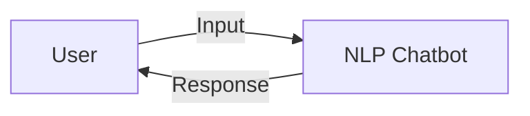

# NLP Chatbot
A real-time natural language processing library for chatbots.
## Problem Statement
Chatbots often struggle to understand and respond to user input in a dynamic and engaging manner.
## Why it Matters
Real-time NLP enables chatbots to provide more accurate and helpful responses, enhancing the user experience.
## Architecture

## Project Structure
```
nlp-chatbot/
├── README.md
├── CONTRIBUTING.md
├── requirements.txt
├── main.py
├── src/
│   ├── core.py
│   ├── nlp.py
│   └── utils.py
```
## Installation
1. Clone the repository: `git clone https://github.com/your-username/nlp-chatbot.git`
2. Install dependencies: `pip install -r requirements.txt`
## Quick Start
1. Run the chatbot: `python main.py`
2. Interact with the chatbot: type messages and receive responses.
## Configuration
Configure the chatbot by modifying the `config.json` file.
## Design Decisions
The chatbot utilizes a modular architecture, with separate modules for NLP, core functionality, and utilities.
## Roadmap
* Improve NLP accuracy
* Enhance user interface
* Integrate with external services
## Contribution
Contributions are welcome. Please submit pull requests and follow the guidelines outlined in `CONTRIBUTING.md`.
## License
MIT License